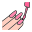

# Hi 👋 My name is Nikita

## I'm a Senior Full Stack Developer

I describe myself as a passionate developer who loves coding, open source, and the web platform ❤️

- 🌍 I'm based in Ukraine
- ✉️ You can contact me at [nikita.syromiatnikov.r@gmail.com](nikita.syromiatnikov.r@gmail.com)
- 🤝 I'm open to collaborating on project work or partnerships

### Skills

  

### Socials

 
  

